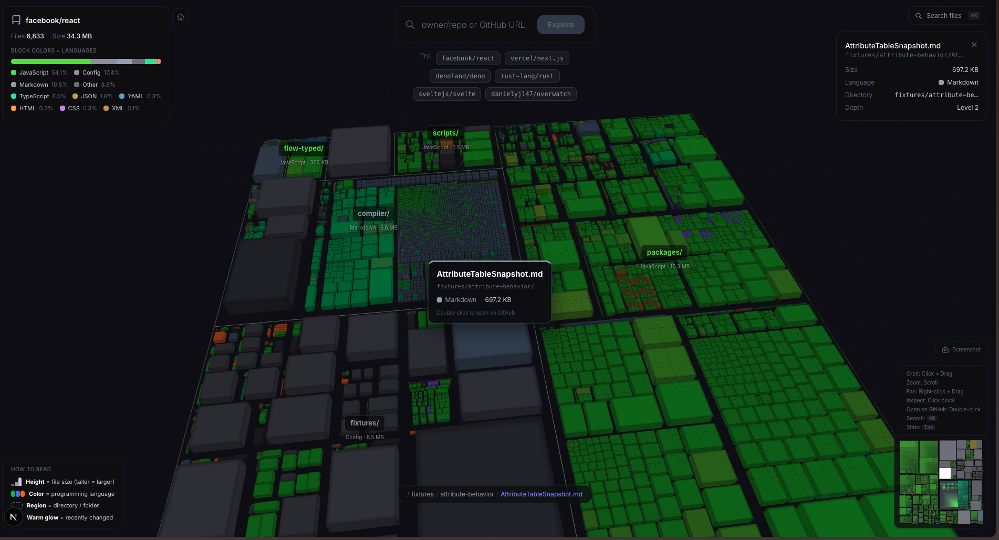
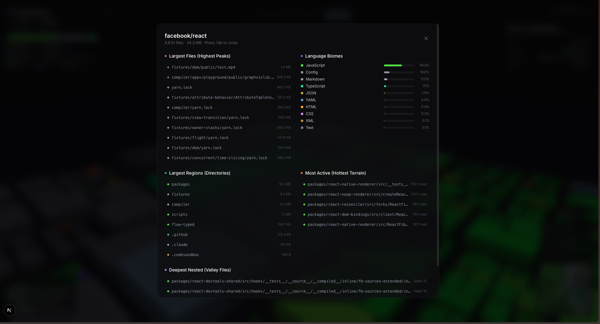

# Repo Topography

**See the shape of any codebase.** Structure becomes geography. Activity becomes weather. Languages become biomes.

Repo Topography transforms any public GitHub repository into an interactive 3D terrain landscape. A developer can look at it for five seconds and understand things about a repo that would take twenty minutes of manual exploration.


*facebook/react rendered as terrain. Green peaks are JavaScript/TypeScript files. Height = file size. Regions = directories.*

## How It Works

The core metaphor: **a codebase is a landscape.**

| Data | Terrain Feature | Why |
|------|----------------|-----|
| **Directory structure** | Regions & valleys | Related files cluster together spatially |
| **File size** | Elevation (height) | Tall peaks = large/complex files, visible at a glance |
| **Programming language** | Biome color | JavaScript = forest green, Python = ocean blue, Rust = desert orange |
| **Commit activity** | Heat glow | Recently active files glow warm; dormant code stays cool |

The terrain is built using a **squarified treemap** algorithm that maps the file tree into 2D rectangular regions, then extrudes each file into a 3D block. The result is a navigable landscape that encodes four dimensions of repository data simultaneously.

## Features

- **Instant 3D terrain** from any public GitHub repo via `owner/repo` or full URL
- **Click** any block to inspect file details (size, language, path, activity)
- **Double-click** to open the file directly on GitHub
- **Cmd+K** file search with fly-to-file camera navigation
- **Minimap** (bottom-right) for spatial orientation and click-to-navigate
- **Stats dashboard** (press Tab) with largest files, deepest nesting, language breakdown, most active files
- **Cinematic camera** intro that sweeps in when a repo loads
- **Shareable URLs** via `?r=owner/repo` query parameter
- **Screenshot export** to PNG
- **GitHub token support** for higher API rate limits
- **Progressive enrichment** — terrain renders instantly, commit heat data loads in the background


*Press Tab to see the stats dashboard: largest files, language biomes, most active files, deepest nesting.*

## Getting Started

### Prerequisites

- Node.js 18+
- npm or yarn

### Install & Run

```bash
git clone https://github.com/danielyj147/repo-topography.git
cd repo-topography
npm install
npm run dev
```

Open [http://localhost:3000](http://localhost:3000) and enter a repository.

### GitHub Token (Optional)

Without a token, GitHub allows 60 API requests/hour. To increase this to 5,000/hr:

1. Create a [Personal Access Token](https://github.com/settings/tokens) (no scopes needed for public repos)
2. Click "Add GitHub Token" on the landing page and paste it in
3. The token is stored in your browser's localStorage — never sent to any server except GitHub's API

Alternatively, create a `.env.local` file:

```
GITHUB_TOKEN=ghp_your_token_here
```

## Controls

| Action | Input |
|--------|-------|
| Orbit camera | Click + drag |
| Zoom | Scroll wheel |
| Pan | Right-click + drag |
| Inspect file | Click block |
| Open on GitHub | Double-click block |
| Deselect | Click empty space |
| Search files | Cmd+K / Ctrl+K |
| Stats dashboard | Tab |
| Back to home | Home button (top-left) |

## Design

### Data-to-Terrain Mapping

#### Directory Layout → Treemap Geography

The repository's file tree is converted to a **squarified treemap** layout. Each directory becomes a bounded region on the terrain plane, with its children nested inside. This spatial mapping preserves the developer's mental model: related files cluster together, and directory boundaries create visible valleys (gaps between blocks).

**Why treemap?** It's the only layout algorithm that simultaneously encodes hierarchy, relative size, and adjacency in 2D space. A developer can look at the terrain and immediately identify "that large region is `src/components`" without reading any labels.

#### File Size → Elevation (Height)

Each file's size in bytes maps to the height of its terrain block. The mapping uses a **power curve** (`pow(size / maxSize, 0.4)`) rather than linear to prevent a single massive file from flattening everything else. This produces a natural-looking landscape with clear peaks for large files and gently rolling hills for smaller ones.

**Why file size?** It's the strongest proxy for complexity available without parsing file contents. A 5,000-line file is almost always more complex than a 50-line one. Elevation is the most immediately readable visual dimension — tall = complex is intuitive.

#### Programming Language → Biome Color

Files are colored by their detected programming language, using a nature-inspired palette:

| Language | Biome | Visual |
|----------|-------|--------|
| JavaScript/TypeScript | Forest | Deep greens → bright emerald |
| Python | Ocean | Navy blue → sky blue |
| Rust/C/C++ | Desert | Sandstone → warm orange |
| Java/Kotlin | Tundra | Slate → cool gray |
| Ruby | Coral Reef | Deep purple → magenta |
| Go | Sandstone | Brown → amber |

**Why biome colors?** Language distribution is one of the first things developers want to know about an unfamiliar codebase. Color is pre-attentive — the brain processes it before conscious thought, making language distribution readable at a glance. The biome metaphor makes the colors memorable rather than arbitrary.

#### Commit Activity → Heat Glow (Progressive Enrichment)

After the terrain renders, commit data is fetched asynchronously and applied as a heat overlay. Files with recent frequent commits glow warm orange-red; dormant files stay cool. This loads progressively — the terrain is usable immediately, and the heat map appears as a secondary "geological survey."

**Why progressive?** Commit data requires multiple API calls. Blocking the initial render would make the experience feel broken. By loading it in the background, users get instant terrain plus a visual "aha" moment when activity data arrives.

### Interaction Design

The design philosophy: **no tutorial needed**. Every interaction uses patterns developers already know — Cmd+K search, orbit controls, minimaps. The terrain teaches its own mapping through consistent visual language, with a "How to Read" legend always visible.

## Architecture

```
Next.js 16 (App Router)
├── API Routes
│   ├── /api/repo      GitHub tree + metadata (10min server cache)
│   └── /api/commits   Commit activity enrichment
├── Data Layer
│   ├── github.ts      API client, tree builder, language detection
│   ├── treemap.ts     Squarified treemap layout algorithm
│   └── languages.ts   50+ file extensions → biome color mapping
├── State
│   └── Zustand store  Single source of truth for all app state
├── 3D Rendering
│   ├── React Three Fiber + drei
│   ├── Custom GLSL shaders (per-face lighting, edge darkening, heat glow)
│   ├── Instanced rendering for 10k+ file repos (single draw call)
│   └── Spatial grid for O(1) click detection
└── UI
    ├── Glass-morphism panels (Tailwind CSS v4)
    ├── Cinematic camera intro
    ├── File search (Cmd+K), minimap, breadcrumb
    └── Stats overlay, export to PNG
```

### Key Technical Decisions

**Dual rendering paths:** Repos under 500 files use individual `<TerrainBlock>` meshes with custom GLSL shaders (per-block hover effects, smooth animations). Repos over 500 files switch to `InstancedMesh` rendering — a single draw call for all blocks, with per-instance color attributes. This means a 10,000-file monorepo renders at 60fps.

**Server-side API caching:** The `/api/repo` endpoint caches responses in-memory for 10 minutes. The first user to explore `facebook/react` pays the API cost; subsequent users get instant response.

**Squarified treemap:** The layout algorithm optimizes for square-ish rectangles rather than elongated strips. This matters for 3D terrain because narrow rectangles become invisible pillars when extruded, while squares become satisfying blocks.

**Staggered rise animation:** When terrain generates, blocks rise from the ground in a radial wave from center outward. The delay is computed from each block's distance to center, creating a natural ripple effect.

### Performance

| Repo Size | Rendering Strategy | Performance |
|-----------|-------------------|-------------|
| < 500 files | Individual meshes with per-block GLSL shaders | Full hover effects, smooth animations |
| 500+ files | `InstancedMesh` — single draw call, typed array animation | 60fps with 10k+ blocks |

Key optimizations:
- **Zero per-frame allocations** in the animation loop (pre-computed Float32Arrays, scratch Matrix4/Vector3 objects)
- **Spatial grid** for click detection (O(1) average vs O(n) linear scan)
- **Progressive enrichment** — commit data loads asynchronously, never blocks initial render
- **Server-side API caching** — 10-minute TTL prevents redundant GitHub API calls

### Tradeoffs

- **Tree API truncation:** GitHub's recursive tree API truncates at ~100k entries. For truly massive monorepos, some files will be missing. The app shows a warning but still renders what's available. Paginated tree walking would require 100+ API calls.

- **Custom GLSL shaders vs. standard materials:** Custom shaders give precise control over terrain visuals (per-face lighting, edge darkening, heat glow) but are harder to maintain. The instanced path uses a simpler shader for performance.

- **Client-side layout computation:** The treemap is computed in the browser. For a 50k-file repo, this takes ~100ms. Server-side computation would mean storing layout state, complicating caching and adding latency.

## Tech Stack

| Layer | Technology |
|-------|-----------|
| Framework | Next.js 16 (App Router, TypeScript) |
| 3D Engine | React Three Fiber + Three.js + drei |
| Shaders | Custom GLSL (vertex + fragment) |
| State | Zustand |
| Styling | Tailwind CSS v4 |
| API | GitHub REST API (server-side proxy with caching) |

## What I Would Build Next

1. **Time scrubber** — Scrub through commit history and watch the terrain evolve. New files rise, deleted files crumble, active areas pulse.
2. **Team heatmap** — Color by contributor to reveal ownership patterns and bus-factor risks.
3. **Branch comparison** — Side-by-side terrain morphing between branches or releases.
4. **Function-level zoom** — Zoom into a file and it subdivides into functions via tree-sitter parsing.
5. **GitHub OAuth** — Authenticate for private repos and 5,000 req/hr rate limit.
6. **WebGPU rendering** — Compute shaders for real-time layout updates.

## License

MIT
